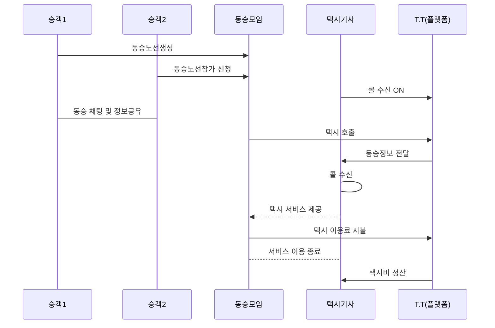

# 2019 학생창업유망팀 300 / 한림대학교 졸업작품

### T.T(Taxi Together), 택시 동승 중개 플랫폼 앱 서비스
> 출발지와 목적지가 유사한 경로의 고객을 매칭하여 택시를 호출하는 서비스로, 택시비의 부담을 줄이고, 택시배차의 문제점을 해결하기 위한 프로젝트입니다.
- 박찬영(팀장 | 서비스 프로세스 기획, 앱 풀스택 개발 참여)
- 김성원(팀원 | 서비스 기획, 마케팅)
- 박지현(팀원 | 서비스 기획, 마케팅)
- 박시연(팀원 | 디자이너)
- 남우석(팀원 | 웹개발)

### 수상이력
 #### 2018 한림SW해커톤 우수상
 

 #### 2019 한림 Spin-Off 창업팀 선정

 #### 2019 교육부 학생창업유망팀 300 선정
 

### 개발 스택
 - Front-End : Android Studio(Java)
 - Database : Firebase Real-time DB
 - Storage : Firebase
 - API : 로그인(Kakao Login), 지도(Google Maps), 포인트 충전(KakaoPay), 경로 안내(KakaoNavi)

### 서비스 주요기능
[서비스 플로우(Figma)](https://www.figma.com/proto/50XVq776jzv2fP4utwKaGn/T.T(Taxi-Together)?type=design&node-id=6-101&t=d7xj2SKXMHAV2AGU-1&scaling=contain&page-id=0%3A1&mode=design)
- 플랫폼 포인트 
    - [카카오페이](https://developers.kakaopay.com/docs/payment/online/single-payment)를 통해 간편하게 충전하여, 택시동승비 결제에 사용합니다.
- 노선검색 및 생성/참가
    - 원하는 출발지와 도착지의 노선을 검색하여, 기존노선에 참가하거나, 노선을 생성합니다.
    - [Google Maps](https://developers.google.com/maps/documentation/android-sdk?hl=ko&_gl=1*rw7gzn*_up*MQ..*_ga*MTc0NDIzOTg0LjE3MDgzMTkzODc.*_ga_NRWSTWS78N*MTcwODMxOTM4Ni4xLjAuMTcwODMxOTM4Ni4wLjAuMA..)에서 [내가 원하는 반경범위](https://developers.google.com/maps/documentation/android-sdk/reference/com/google/android/libraries/maps/model/Circle?hl=ko)안의 원하는 노선만 필터링하여 표시합니다.
- 동승자간 채팅
    - 동승자간 모임장소, 특이사항 등을 공유하기 위한 소통창구입니다.
    - [Firebase RealTime DB](https://firebase.google.com/docs/database/android/read-and-write?hl=ko&_gl=1*11bezr1*_up*MQ..*_ga*MTg4ODMwNDQ0LjE3MDgzMTk4MjA.*_ga_CW55HF8NVT*MTcwODMxOTgyMC4xLjAuMTcwODMxOTgyMC4wLjAuMA..#read_data)로 실시간 채팅을 구현했습니다.

### 결과물
- [서비스 디자인 및 설명(Figma)](https://www.figma.com/file/50XVq776jzv2fP4utwKaGn/T.T(Taxi-Together)?type=design&node-id=0%3A1&mode=design&t=WEFFSUXLxd9jPOWc-1)

### 서비스 흐름도

